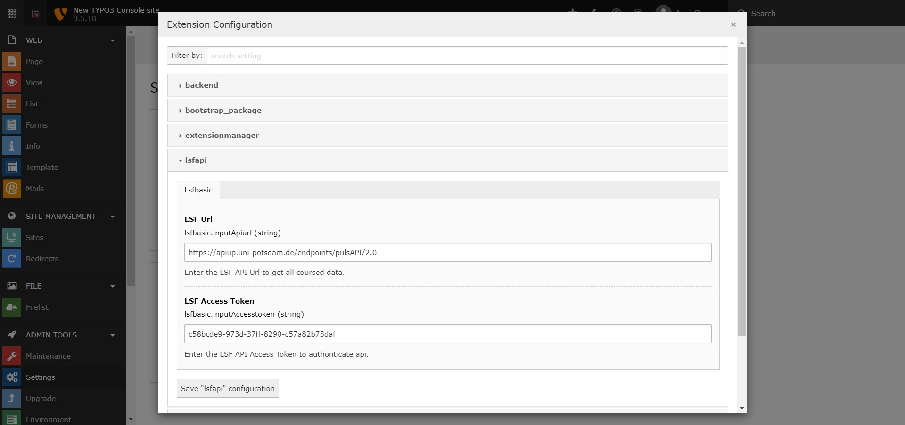
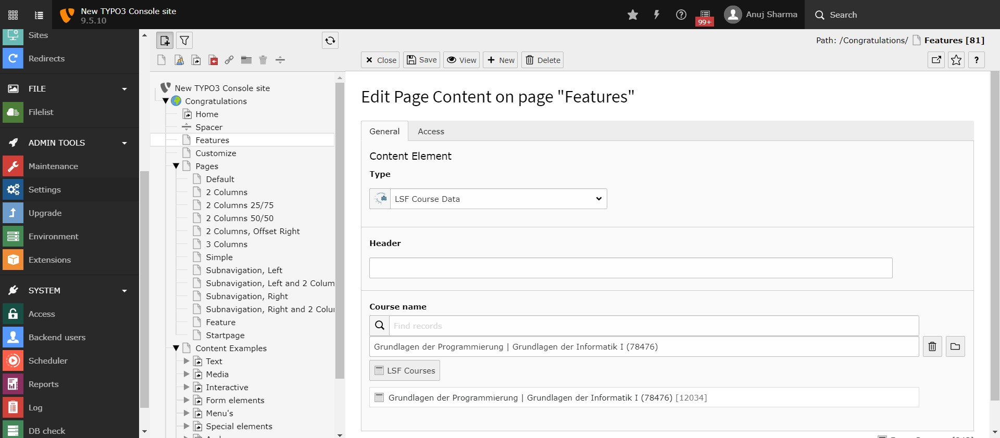

# lsf-cms-plugin

# How to install and configure 

1. Install zip file through extension option in backend
2. Flush all backend and frontend cache.
3. Add Api url under the setting > Extension Configuration > LSFApi 
4. Add LSFApi Data(lsfapi) static Template under the Template > Info/Modify > Includes option.
5. Now add plugin in backend layout where you want on which page.

# Which functions are covered
1. Show Course Data On Typo3 Website page.
2. Add filter Search in typo3 backend pages.
3. Update course data according to cron job.

# Versions covered
<table>
<thead>
<tr>
<th>LSFApi Ext</th>
<th>TYPO3</th>
<th>PHP</th>
</tr>
</thead>
<tbody>
<tr>
<td>1.x</td>
<td>9.0 - 9.x </td>
<td>7.0 - 7.x</td>
</tr>
</tbody>
</table>

# Restrictions
If you have add include Static template under Template option in typo3 backend. Add LSFApi Static Template Above the  bootstap package static template

# Examples
**Configuration Orcid API Url with Extension**

**Backend page Layout**

**Frontend page layout**

# Contact

In case of question please send an email to asharma@uni-potsdam.de